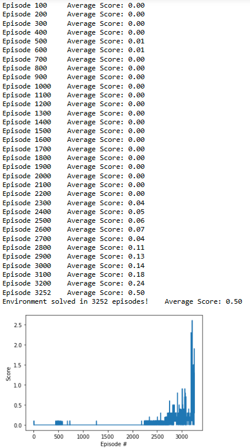

# Report of the Project: Collaboration and Competition

 ## Learning algorithm

 ### Deep Deterministic Policy Gradient (DDPG)

 The DDPG algorithm is an actor-critic based algorithm used for learning **continuous** action spaces. 
 #### Components
 
 The agent has two type of neural networks: an actor network and a critic network. The actor network is used to select best actions for each state, <br>
 while the critic network is used to estimate the Q-value function for each state-action pair.<br>
 Two networks with identical architecture are initiated for both actor network and critic network, which are called local network and target network, respectively for stable training of the networks.<br>
 As DDPG is an off-policy algorithm, a replay buffer is used to store and sample experience tuples.<br>
 In the tennis games, the two agents use the same actor and critic network, and share the replay buffer.

#### Training process

Initialize replay buffer, actor network, critic network, target networks, and noise process.<br>
For each time step:<br>
Observe state from environment.<br>
Use actor network to generate actions for current state.<br>
Add noise to actions if desired.<br>
Send actions to environment and observe next state, reward, and done flag.<br>
Store experience tuple (state, action, reward, next_state, done) in replay buffer.<br>
When the experience tuple reachs predefine batch size, sample batch of experiences from replay buffer.<br>
Update critic network:<br>
Compute Q targets using Bellman equation.<br>
Compute critic loss as mean squared error between Q targets and Q values predicted by critic network.<br>
Update critic network parameters using Adam optimizer.<br>
Update actor network:<br>
Compute actor loss as negative mean of Q values predicted by critic network for given state-action pairs.<br>
Update actor network parameters using Adam optimizer.<br>
Soft update target networks with the parameters of the local networks.<br>
Repeat to store another batch of experience tuple in replay buffer and learn until desired number of time steps or average score is reached.<br>

#### Network architecture

##### Actor network
```
 Input nodes (33=state_size) -> Fully Connected Layer (256 nodes, Relu activation) -> Ouput nodes (4=action_size, Tanh Activation)
```

##### Critic network
```
Input nodes (33=state_size) -> Fully Connected Layer (256 nodes, Leaky ReLU activation) -> Fully Connected Layer (256 + 4=action size nodes to 256 nodes, Leaky ReLU activation) -> Fully Connected Layer (256 nodes to 128 nodes, Leaky ReLU activation) -> Ouput nodes (1)
```

#### Training parameter

```
BUFFER_SIZE = int(1e5)  # replay buffer size
BATCH_SIZE = 128        # minibatch size
GAMMA = 0.99            # discount factor
TAU = 1e-3              # for soft update of target parameters
LR_ACTOR = 1e-4         # learning rate of the actor 
LR_CRITIC = 1e-3        # learning rate of the critic
WEIGHT_DECAY = 0        # L2 weight decay
```

## Training results



The environment was solved in 3252 episodes.

## Ideas for future work

First idea is fine tune the training parameter, such as a higher learning rate, higher factor of soft update or larger batch size of repaly buffer  to speed up the training. <br>
Second option is using Prioritized Experience Replay. Instead of sampling experience buffer uniformly, more important buffer have higher priority and thus sampled with higher probability. To do so, the replay buffer is stored along with its calculated TD error. The bigger its error, the more we expect to learn and higher sampling probability is assigned. As a result, more important experiences are replayed more frequently and thus the agent learn more efficiently.<br>
Third option is exploring different neural network architectures, such as adding more layers to the neural networks, using different activation functions.
Finally, implementing more advanced reinforcement learning algorithms, such as Trust Region Policy Optimization (TRPO), Truncated Natural Policy Gradient (TNPG), or Distributed Distributional Deterministic Policy Gradients (D4PG), could also help to see whether any improvement of the agent's performance.
